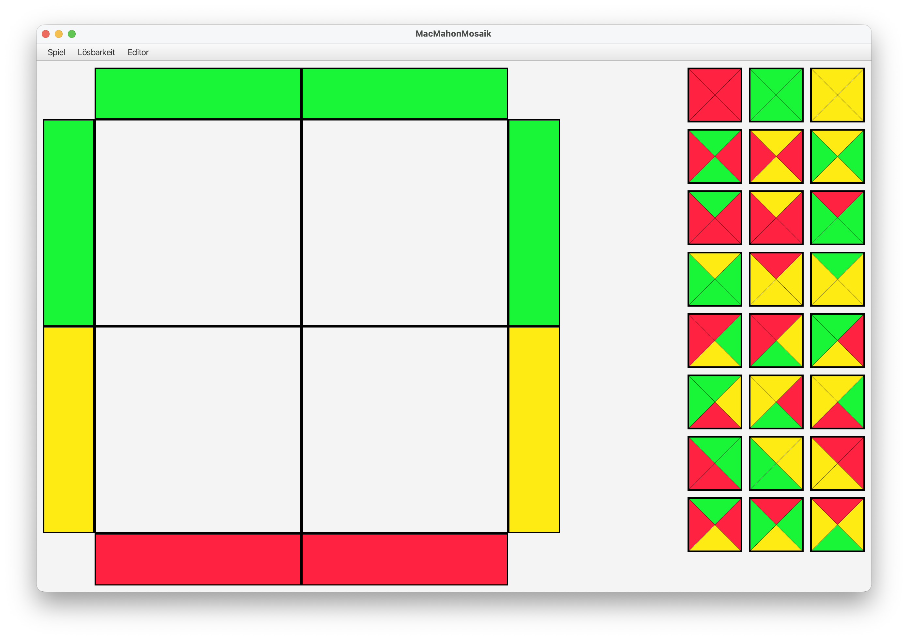
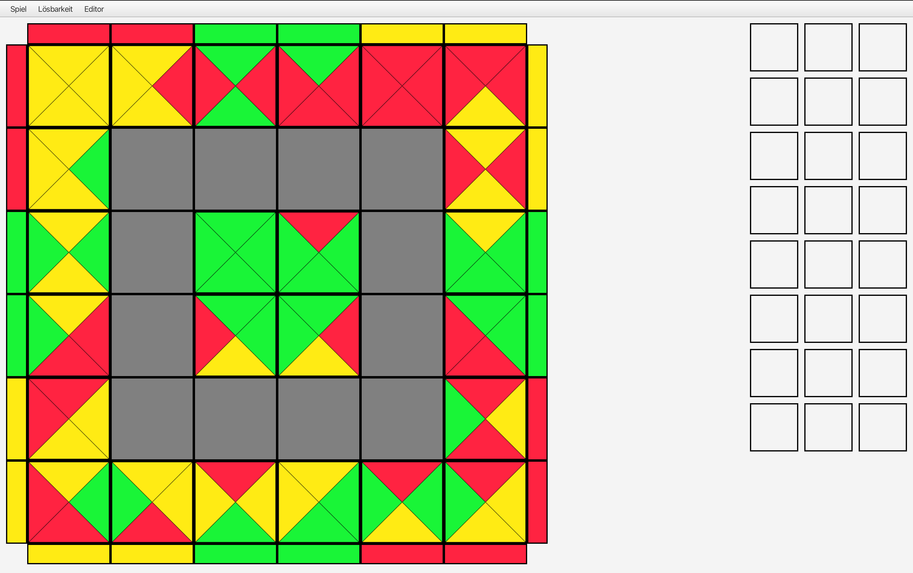

# MacMahonMosaic

A tile-laying game where the goal is to fill the entire grid while ensuring that adjacent tiles have matching sides.

Developed as part of a university project in 2025.

The project focuses on a clean separation between GUI and game logic. It also features a backtracking algorithm that can automatically solve the game board.

## Screenshots

### Interface

### Solved Board

## Project Structure

- `src/` – Source code
- `images/` – Screenshots
- `documentation/` – Project documentation

## Links

**Source Code:** [View Source Code](https://github.com/antonburmester/macmahon-mosaic/tree/main/src)

**Documentation:** [View Documentation](https://github.com/antonburmester/macmahon-mosaic/blob/main/documentation/MacMahonMosaic_Documentation.pdf)
